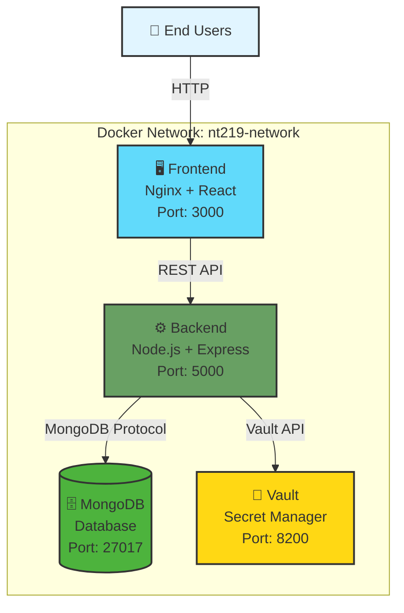
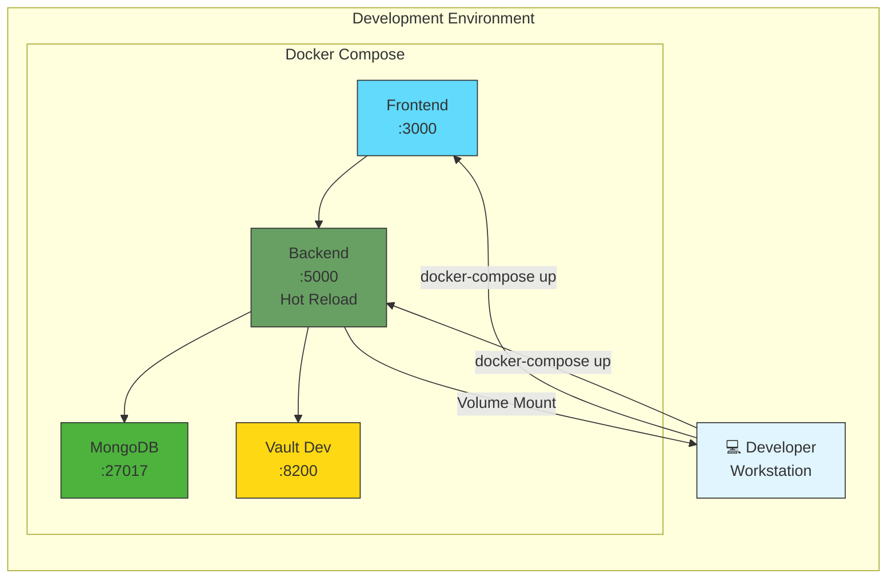
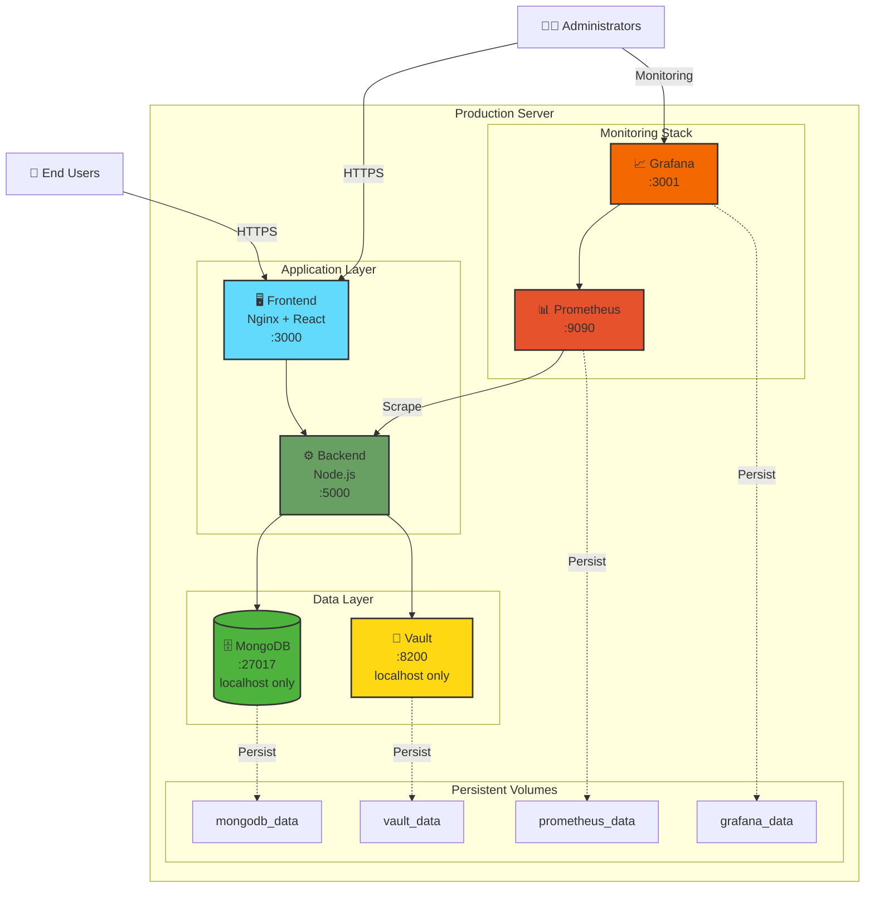
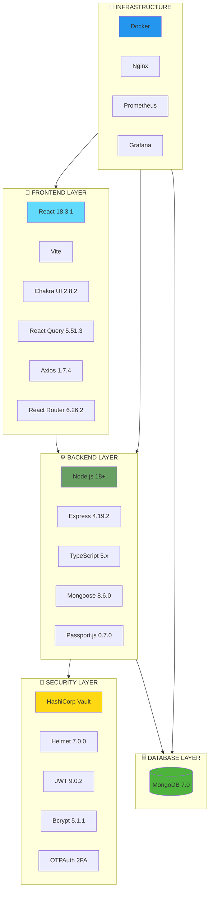
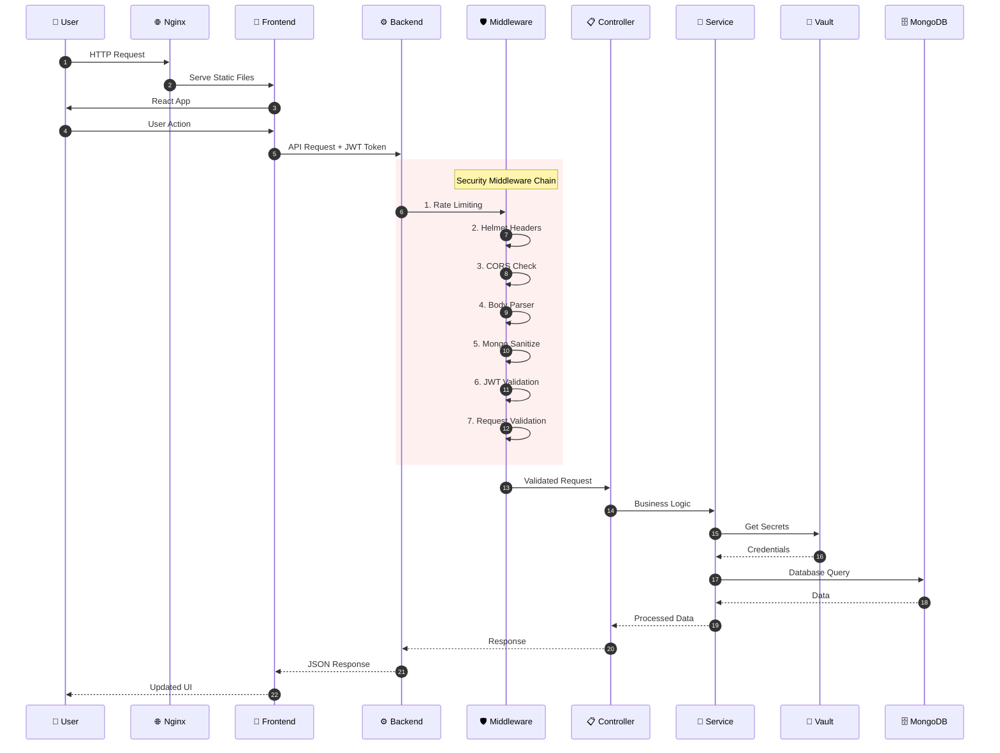
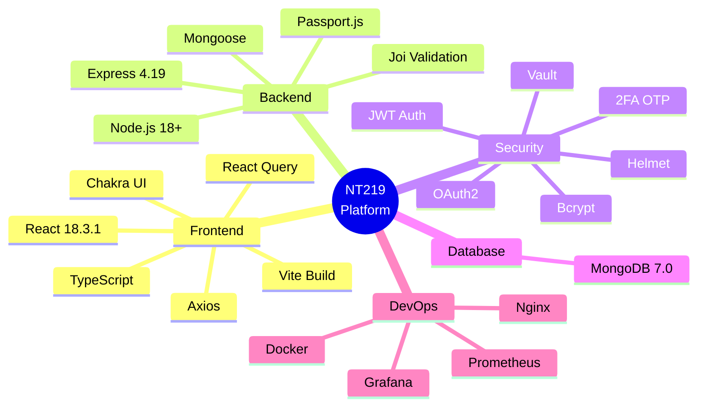

# 4.1. Triển khai hệ thống

## 4.1.1. Môi trường

### Tổng quan kiến trúc triển khai

Hệ thống NT219 Secure E-commerce Platform được triển khai theo mô hình containerization sử dụng Docker, cho phép cô lập các service và dễ dàng quản lý, mở rộng.

#### Kiến trúc Docker Network



### Môi trường Development

Môi trường phát triển được cấu hình trong file `docker-compose.yml` với các đặc điểm:

| Service | Container Name | Port | Mô tả |
|---------|---------------|------|-------|
| Frontend | nt219-frontend | 3000:80 | React app với Nginx |
| Backend | nt219-backend | 5000:5000 | Node.js API server |
| MongoDB | nt219-mongodb | 27017:27017 | Database server |
| Vault | nt219-vault | 8200:8200 | Secret management |



**Đặc điểm Development:**

- Hot reload cho backend với `ts-node-dev`
- Volume mounting để phát triển real-time
- Vault chạy ở dev mode với token mặc định
- MongoDB không có authentication

**Lệnh khởi chạy:**
```bash
docker-compose up -d
```

### Môi trường Production

Môi trường production được cấu hình trong file `docker-compose.prod.yml` với các tính năng bảo mật cao hơn:

| Service | Container Name | Port Binding | Mô tả |
|---------|---------------|--------------|-------|
| Frontend | nt219-frontend-prod | 3000:80 | Optimized build |
| Backend | nt219-backend-prod | 5000:5000 | Production mode |
| MongoDB | nt219-mongodb-prod | 127.0.0.1:27017:27017 | Localhost only |
| Vault | nt219-vault-prod | 127.0.0.1:8200:8200 | Production config |
| Prometheus | nt219-prometheus | 9090:9090 | Metrics collection |
| Grafana | nt219-grafana | 3001:3000 | Monitoring dashboard |



**Đặc điểm Production:**

- Port binding chỉ localhost cho database và vault
- Logging với JSON format và rotation
- Health checks với interval dài hơn
- Restart policy: always
- Resource limits cho containers

**Lệnh khởi chạy:**
```bash
docker-compose -f docker-compose.prod.yml up -d
```

### Docker Volumes

| Volume Name | Service | Mount Path | Mục đích |
|-------------|---------|------------|----------|
| mongodb_data | MongoDB | /data/db | Lưu trữ dữ liệu database |
| mongodb_config | MongoDB | /data/configdb | Cấu hình MongoDB |
| vault_data | Vault | /vault/data | Lưu trữ secrets |
| vault_logs | Vault | /vault/logs | Vault logs |
| prometheus_data | Prometheus | /prometheus | Metrics data |
| grafana_data | Grafana | /var/lib/grafana | Dashboard configs |

### Health Checks

Hệ thống implement health checks cho tất cả services:

| Service | Health Check Endpoint | Interval | Timeout |
|---------|----------------------|----------|---------|
| Backend | GET /api/v1/health | 30s | 10s |
| Frontend | GET /health | 30s | 10s |
| MongoDB | mongosh ping | 10s (dev) / 30s (prod) | 5s / 10s |
| Vault | vault status | 10s | 5s |

---

## 4.1.2. Công nghệ sử dụng

### Tổng quan Stack công nghệ



### Chi tiết công nghệ Frontend

| Công nghệ | Phiên bản | Mục đích sử dụng |
|-----------|-----------|------------------|
| React | 18.3.1 | Thư viện xây dựng giao diện người dùng |
| TypeScript | 5.4.5 | Ngôn ngữ lập trình với static typing |
| Vite | Latest | Build tool và development server |
| Chakra UI | 2.8.2 | Component library cho UI |
| Emotion | 11.13.0 | CSS-in-JS styling |
| React Query | 5.51.3 | Server state management |
| React Hook Form | 7.53.1 | Quản lý form và validation |
| React Router | 6.26.2 | Client-side routing |
| Axios | 1.7.4 | HTTP client |
| Stripe.js | 4.5.0 | Payment integration |
| Zod | 3.23.8 | Schema validation |
| Framer Motion | 12.23.24 | Animation library |
| Day.js | 1.11.11 | Date manipulation |

### Chi tiết công nghệ Backend

| Công nghệ | Phiên bản | Mục đích sử dụng |
|-----------|-----------|------------------|
| Node.js | >= 18 | JavaScript runtime |
| Express | 4.19.2 | Web application framework |
| TypeScript | 5.x | Static type checking |
| MongoDB | 7.0 | NoSQL database |
| Mongoose | 8.6.0 | MongoDB ODM |
| Passport.js | 0.7.0 | Authentication middleware |
| passport-google-oauth20 | 2.0.0 | Google OAuth authentication |
| jsonwebtoken | 9.0.2 | JWT token generation/verification |
| Bcrypt | 5.1.1 | Password hashing |
| OTPAuth | 9.4.1 | Two-factor authentication |
| Joi | 17.12.1 | Request validation |
| Multer | 1.4.5-lts.1 | File upload handling |
| Nodemailer | 7.0.10 | Email service |
| node-cron | 4.2.1 | Task scheduling |
| Pino | 9.3.0 | Structured logging |
| prom-client | Latest | Prometheus metrics |

### Chi tiết công nghệ Security

| Công nghệ | Phiên bản | Mục đích sử dụng |
|-----------|-----------|------------------|
| HashiCorp Vault | Latest | Quản lý secrets tập trung |
| Helmet | 7.0.0 | Security HTTP headers |
| CORS | 2.8.5 | Cross-origin resource sharing |
| Express Rate Limit | 6.10.0 | Rate limiting |
| HPP | 0.2.3 | HTTP Parameter Pollution protection |
| express-mongo-sanitize | 2.2.0 | NoSQL injection prevention |
| cookie-parser | 1.4.6 | Cookie handling |
| express-session | 1.18.2 | Session management |

### Chi tiết công nghệ Infrastructure

| Công nghệ | Phiên bản | Mục đích sử dụng |
|-----------|-----------|------------------|
| Docker | Latest | Containerization |
| Docker Compose | Latest | Multi-container orchestration |
| Nginx | Latest | Web server, reverse proxy |
| Prometheus | Latest | Metrics collection |
| Grafana | Latest | Metrics visualization |

### Luồng xử lý Request



### Kiến trúc bảo mật đa lớp

```mermaid
graph TB
    subgraph L1["🌐 LAYER 1: NETWORK SECURITY"]
        L1A["Docker Network<br/>Isolation"]
        L1B["CORS Policy"]
        L1C["Rate Limiting"]
        L1D["Security Headers<br/>(Helmet)"]
    end
    
    subgraph L2["🛡️ LAYER 2: APPLICATION SECURITY"]
        L2A["Input Validation<br/>(Joi)"]
        L2B["Input Sanitization"]
        L2C["HPP Protection"]
        L2D["XSS Prevention"]
    end
    
    subgraph L3["🔑 LAYER 3: AUTHENTICATION"]
        L3A["JWT Token"]
        L3B["OAuth2<br/>(Google)"]
        L3C["2FA<br/>(OTPAuth)"]
        L3D["Password Hash<br/>(Bcrypt)"]
    end
    
    subgraph L4["🔒 LAYER 4: DATA SECURITY"]
        L4A["Secret Management<br/>(Vault)"]
        L4B["Data Encryption"]
        L4C["MongoDB Security"]
    end
    
    subgraph L5["📊 LAYER 5: MONITORING"]
        L5A["Audit Logging"]
        L5B["Prometheus Metrics"]
        L5C["Grafana Dashboards"]
        L5D["Alert System"]
    end
    
    L1 --> L2
    L2 --> L3
    L3 --> L4
    L4 --> L5
    
    style L1 fill:#ff6b6b,stroke:#333,stroke-width:2px
    style L2 fill:#ffd93d,stroke:#333,stroke-width:2px
    style L3 fill:#6bcf7f,stroke:#333,stroke-width:2px
    style L4 fill:#4d96ff,stroke:#333,stroke-width:2px
    style L5 fill:#a78bfa,stroke:#333,stroke-width:2px
```



### Mind Map công nghệ



---

## Tổng kết

### Đặc điểm nổi bật của hệ thống

**1. Kiến trúc Microservices với Docker**

- Containerization đầy đủ cho tất cả services
- Cách ly môi trường development và production
- Dễ dàng scale và deploy
- Persistent volumes cho data safety

**2. Bảo mật đa lớp**

- HashiCorp Vault cho quản lý secrets
- JWT + OAuth2 + 2FA authentication
- Multiple security middlewares
- Input validation và sanitization

**3. Monitoring & Observability**

- Prometheus metrics collection
- Grafana dashboards
- Structured logging với Pino
- Health checks và alerting

**4. Modern Technology Stack**

- React 18 với Vite (Fast builds)
- TypeScript toàn bộ codebase
- MongoDB 7.0 (Latest stable)
- Node.js 18+ (LTS)

**5. Developer Experience**

- Hot reload trong development
- TypeScript cho type safety
- ESLint + Prettier cho code quality
- Comprehensive testing setup

---

*Tài liệu được tạo tự động - NT219 Project*
